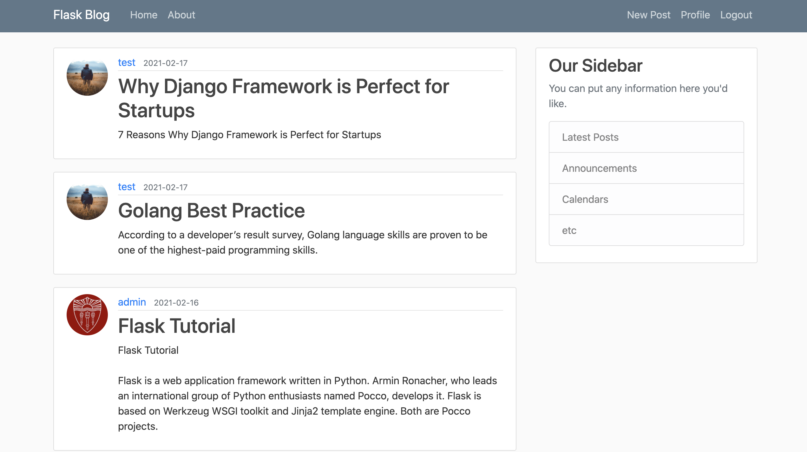
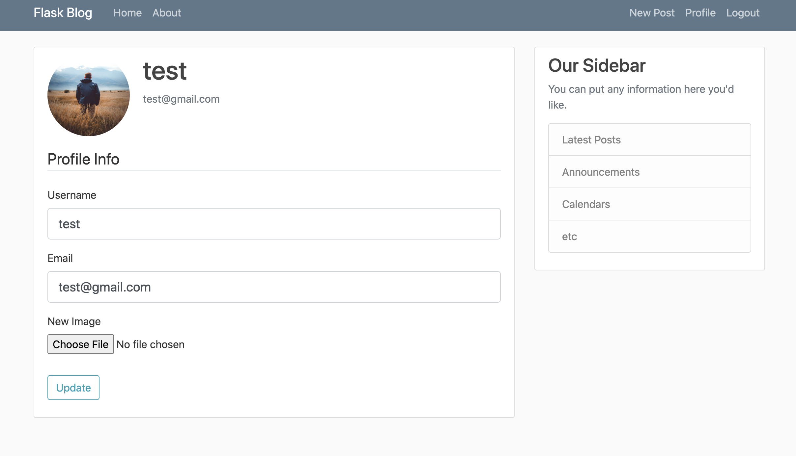

```
git clone https://github.com/gpldirk/Flask-blog.git
```

```
source ./venv/bin/activate
```

```
pip3 install -r requirements.txt
```

指定App/config.py中的：\
MAIL_USERNAME = '{{your email name}}' \
MAIL_PASSWORD = '{{your email password}}' 

```
python3 manage.py runserver -d -r -h 0.0.0.0 -p 9000 
```

 




```
deactivate ./venv/bin/activate
```

1 Flask app 分包操作 
2 在App package下的__init__.py中定义create_app()函数：
- 2.1 创建app，指定static_folder和templates_folder 
- 2.2 加载config 
- 2.3 加载db 
- 2.4 加载blueprint 
- 2.5 加载extensions 
3 根据models及其相关的视图函数放入不同的package中定义models.py/views.py

第三方插件的使用
flask-script: 使用Manager包装app，便于使用含动态参数的命令行 \
flask-migrate: 使用Migrate初始化app，将MigrateCommand注册到manage中，可以直接使用命令行进行模型迁移 \
flask-bootstrap: 使用Bootstrap初始化app，这样可以直接使用bootstrap提供的模版和样式 \
flask-bcrypt: 使用Bcrypt初始化app，对用户的password进行hash 存储，以及读取db password判断是否当前用户给定的password是否正确 \
flask-mail: 使用Mail初始化app，加载config中mail相关参数，使用Message()生成消息，使用mail.send(消息)发送出去 \
flask-login: 使用LoginManager()初始化app，自动管理session相关信息和用户的登陆登出 \
itsdangerous: 当用户忘记密码码时使用serializer生成支持过期时间的token，之后进行验证 \
flask-sqlalchemy: 使用SQLAlchemy()初始化app，直接通过ORM操作数据库 \
flask-wtf: 基于FlaskForm定义Form，指定form中的每个filed及其validators，定义def validate_fieldName(self, fieldName)添加自定义限制 \
secrets: 为app生成随机secret_key; 为上传的文件生成随机的文件名 \
PIL: 为用户上传的image进行resize, 减少存储空间，加快加载速度


    
